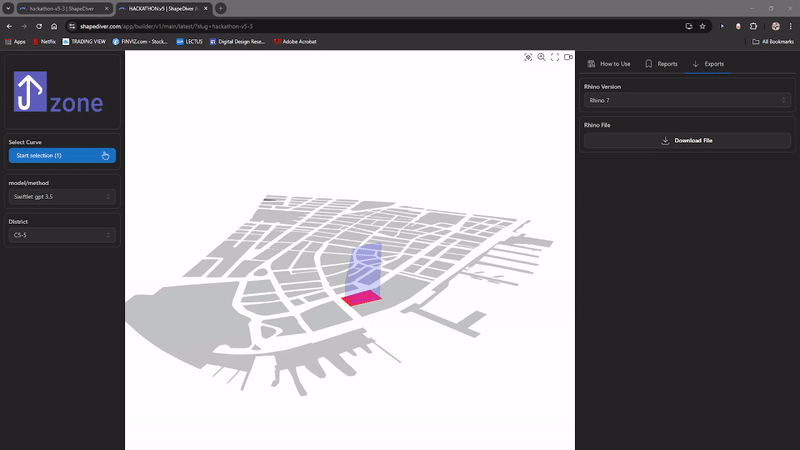

# UPZONE
UpZone is your one-click solution to modeling your NYC lot's buildable zoning volume. 

Prototyped in NYC in 24 hours, the app searches multi-thousand-page zoning resolution documents and city websites, identifies relevant zoning requirements, and generates a user-friendly 3D model for architects to hit the ground running with design. 

UpZone is an app developed during the 2024 [AECTech Hackathon](https://www.aectech.us/nyc-conference) by a diverse team of architects, software developers, machine learning engineers, computational designers, and structural engineers. It combines large language models with spatial algorithms to turn complex and interconnected data into a clean, legible 3D model.

# Prerequisites
In order to use UPZone, you will need:
* A free [Shapediver](https://www.shapediver.com/) account
* An [OpenAI API key](https://platform.openai.com/)

# Zone parameters 
The team experimented with two methods to extract the following parameters:
* Setback: front, rear, and side
* Sky exposure angle
* Height limit
* Maximum height for front yard line

## ChatGPT (method 1)
We utilized [Swiftlet](https://www.food4rhino.com/en/app/swiftlet) to call the ChatGPT API and extract these values from the LLM. Please refer to the grasshopper definition for further details on how prompt engineering was done. 

## Web search + Gemini experiment (method 2)
We utilized a python library to perform search using [DuckDuckGo library](https://pypi.org/project/duckduckgo-search/) and scrape web for the required values. The inputs were then fed to Google Geimini Flash 1.5. 

  
# Grasshopper Plugin
In order to process to geometries, you will need:
* Rhino 7 or 8
* The [Swiftlet](https://www.food4rhino.com/en/app/swiftlet) plugin for grasshopper
* [Lot](https://github.com/ssajedi/upzone/blob/main/geojson/lotGeometries.geojson) geometry data
* [Building Footprint](https://github.com/ssajedi/upzone/blob/main/geojson/lotGeometries.geojson) geometry data

The raw data was processed in QGIS to obtain the subset GeoJSON, which is then converted to Grasshopper polylines using our custom C# component. However, there is an option in the grasshopper script that allows you to make an API call if the data is available as a geoJSON.

Data source:
* Lot geometries: [MapPLUTO - Shoreline Clipped (Shapefile)](https://www.nyc.gov/site/planning/data-maps/open-data/dwn-pluto-mappluto.page). 
* Building geometries: [Building Footprints from NYC Opendata](https://data.cityofnewyork.us/Housing-Development/Building-Footprints/nqwf-w8eh). 

# Team Members

| Name                                   | Company                        |
|----------------------------------------|--------------------------------|
| **Anish Reddy**                        | Perkins & Will                 | 
| **Eddy Lopez**                         | LPA                            |
| **Elcin Ertugrul**                     | Thornton Tomasetti (CORE)      |
| **Georgios Athanasopoulos**            | Thornton Tomasetti (CORE)      |
| **Jari Prachasartta**                  | KPF                            |
| **Jihoon Park**                        | Walter P Moore                 |
| **Joyce Hanlon**                       | Snøhetta                       |
| **Mahsa Dehghani**                     | Memo Studio & Corgan           |
| **Omid Sajedi**                        | Thornton Tomasetti (CORE)      |
| **Susanna van de Graaf**               | Thronton Tomasetti             |
